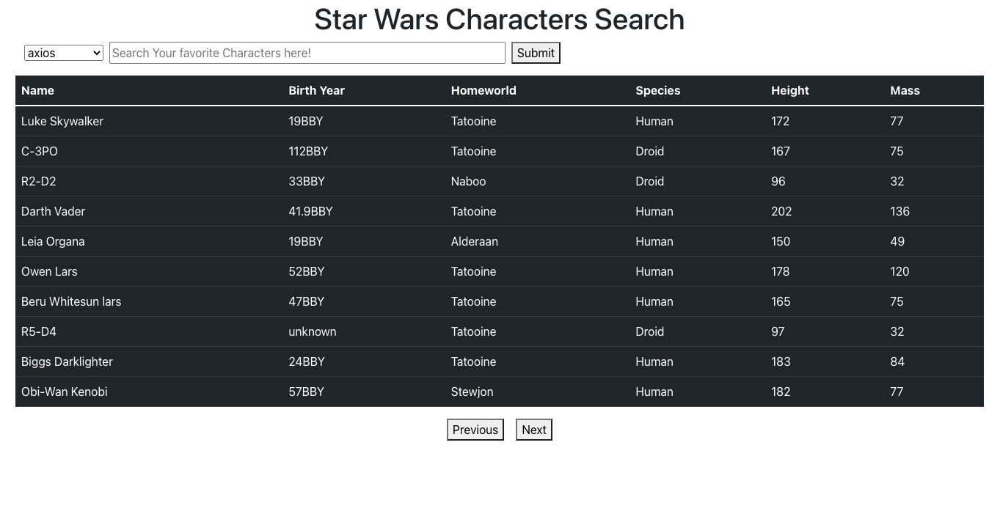

# React based SWAPI Search

_A React App that queries the Star Wars API using axios & vanilla Javascript_

Use it [here](https://swapi-search.herokuapp.com/)

## Summary

Built with:

<ul>
<li>create-react-app</li>
<li>axios</li>
<li>fetch</li>
<li>Async / Await</li>
<li>Bootstrap</li>
<li>Heroku</li>
</ul>

A react based, heroku hosted javascript app that queries the Star Wars API for indivdual characters by name. The search functionallity is expressed via 3 functions that query for the character information, the home planet and the species. Due to the design of the API, the latter two searches cannot be done until the inital query returns.

Styling is handled via a minimal amount of bootstrap. The page is functional on mobile devices but has off styling.

A dropdown menu on the app allows the user to switch between the axios library and vanilla javascript fetch to query the API.

Data is pulled as needed, resulting in multiple requests to the API, causing possibly slow load times. Possible solutions would be to either implement a localStorage feature (which would only speed up individual users after they search) or to implement a postgres database that stores all searches after they are made and accessing the database if a search already exists there.

## Author & Acknowledgments

Lennart Boecken
